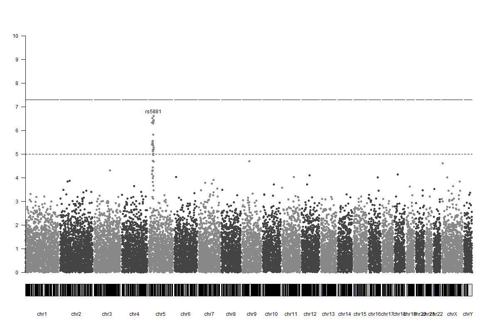
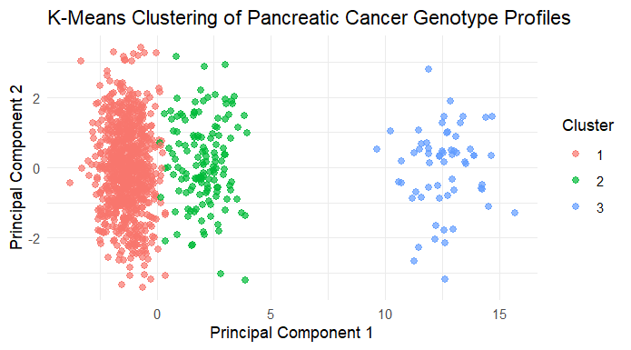

# 2024_GENOMICS_WGAS
Whole-Genome Association Study with plots, and K-Means Prediction on a Simulated Pancreatic Cancer Genotype Dataset.
We have $16 \times 3$ risk levels, a total of $48$ **SNP risk levels**. We have the associated genes for **pancreatic cancer risk genotype**.  

# Manhattan Plot 
Displaying the top significant SNP per chromosome.

# K-Means 
The results for **k=3** risk levels given 2000 patients.

